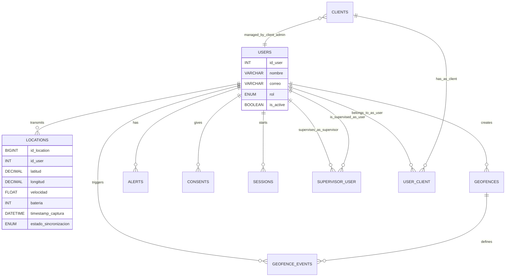

# Capa de Acceso a Datos

## Herramientas de conexión
- **MySQL2**: Librería utilizada para establecer el pool de conexiones.
- **Transacciones SQL**: Se emplean para asegurar que los lotes de ubicaciones (sincronización offline) se guarden de forma atómica.

## Entidades principales

Listado inferido de entidades y sus operaciones recurrentes en la Base de Datos (`schema.sql`):

1. **`Users`**: Usuarios registrados con roles (ADMIN, SUPERVISOR, CLIENT, USER).
2. **`Clients`**: Empresas u organizaciones que contratan el servicio de rastreo.
3. **`User_Client`**: Relación entre un usuario rastreado (USER) y un cliente (CLIENT).
4. **`Supervisor_User`**: Asignación de usuarios a supervisores para su monitoreo.
5. **`Locations`**: Historial de coordenadas (latitud, longitud, velocidad, batería, etc.).
6. **`Geofences`**: Zonas virtuales configuradas (círculos o polígonos).
7. **`Geofence_Events`**: Registro histórico de entradas y salidas de geocercas.
8. **`Alerts`**: Alertas críticas generadas por el sistema (batería baja, geocercas, desconexión).
9. **`Consents`**: Registro de aceptación de términos y condiciones de rastreo.
10. **`Sessions`**: Control de sesiones activas por dispositivo para evitar duplicidad de transmisión.

## Diagrama entidad-relación

A continuación se presenta la estructura de la base de datos y sus relaciones:

